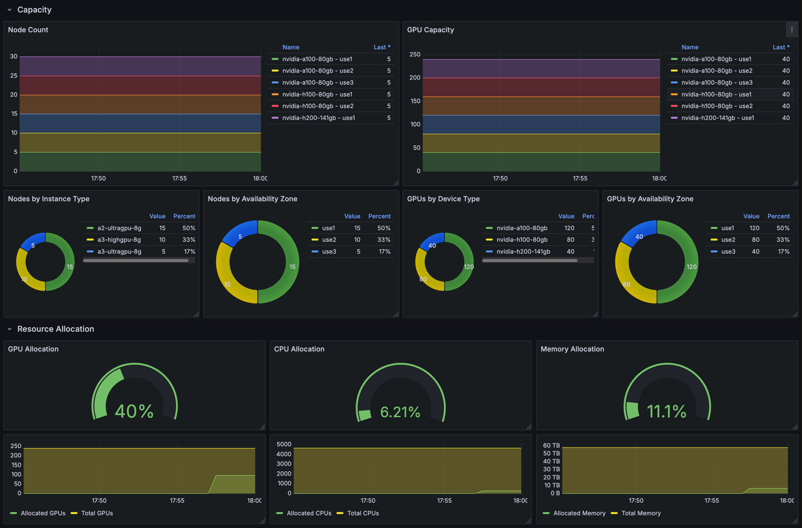

# KEMU: A Declarative Kubernetes Emulator Utility

[](https://goreportcard.com/report/github.com/datastrophic/kemu)
[](LICENSE)

Test your Kubernetes scheduling optimizations at scale without production risk.

KEMU enables safe experimentation with workload scheduling, GPU allocation strategies,
and cluster capacity planning by creating emulated clusters with thousands of nodes
using minimal hardware.

Built on [Kind](https://kind.sigs.k8s.io/) for control plane management and
[KWOK](https://kwok.sigs.k8s.io/) for node emulation, KEMU provides a single
declarative configuration to bootstrap reproducible emulated environments in minutes.

**Perfect for:**
* Testing scheduler modifications before production deployment
* Validating GPU/resource allocation strategies across availability zones
* Capacity planning and workload right-sizing experiments
* CI/CD pipeline integration for automated testing

**Read the blog post
[KEMU: A Declarative Approach to Emulating Kubernetes Clusters at Scale](https://datastrophic.io/declarative-kubernetes-cluster-emulation-with-kemu/)**
for a deep dive into KEMU's design, scheduling optimization use cases, and best practices.

## Why KEMU?
Setting up emulated clusters with Kind and KWOK requires juggling multiple tools,
fragmented configurations, and custom scripts. Creating 1,000+ nodes with varying
capacities and zone distribution quickly becomes overwhelming.

KEMU simplifies this by providing:
* **Single-spec configuration** - Define control plane, addons, and node topology in one YAML
* **Reproducible clusters** - Deterministic bootstrap for humans and CI systems
* **Built-in addon support** - Install schedulers, operators, and monitoring via Helm
* **Minimal resources** - Emulate 1,000+ GPU nodes on a laptop (typically 2-4GB RAM)

## Use Cases

* **GPU Scheduling Optimization** - Test allocation strategies for A100/H100/H200 clusters
* **Multi-Zone Placement** - Validate workload distribution across availability zones
* **Scheduler Testing** - Safely experiment with Kueue, Volcano, Yunikorn, or custom schedulers
* **Capacity Planning** - Model cluster growth and resource utilization
* **CI Integration** - Automated testing of scheduling policies in pipelines

## Quickstart
#### Prerequisites
The following tools must be installed on your system:
* [Docker](https://docs.docker.com/engine/install) - For running Kind containers
* [Go 1.21+](https://go.dev/doc/install) - For building KEMU
* [Kind](https://kind.sigs.k8s.io/) - Used by KEMU for control plane
* [kubectl](https://kubernetes.io/docs/tasks/tools/#kubectl) - For cluster interaction
* [Helm](https://helm.sh/docs/intro/install/) - For addon installation

**System requirements:** 8GB+ RAM recommended for clusters with multiple addons and nodes.

#### Install `kemu`:
```shell
go install github.com/datastrophic/kemu
```

#### Create a cluster
```shell
kemu create-cluster  --kubeconfig $(pwd)/kemu.config --cluster-config https://raw.githubusercontent.com/datastrophic/kemu/refs/tags/v0.1.0/examples/gcp-small.yaml
```

#### Explore the cluster
```shell
export KUBECONFIG=$(pwd)/kemu.config

kubectl get nodes

# Example output:
# NAME                    STATUS   ROLES           AGE     VERSION
# a2-ultragpu-8g-use1-0   Ready    agent           99s     v1.33.1
# a2-ultragpu-8g-use1-1   Ready    agent           99s     v1.33.1
# a2-ultragpu-8g-use1-2   Ready    agent           99s     v1.33.1
# a2-ultragpu-8g-use1-3   Ready    agent           99s     v1.33.1
# a2-ultragpu-8g-use1-4   Ready    agent           99s     v1.33.1
# a2-ultragpu-8g-use2-0   Ready    agent           99s     v1.33.1
# a2-ultragpu-8g-use2-1   Ready    agent           99s     v1.33.1
# a2-ultragpu-8g-use2-2   Ready    agent           99s     v1.33.1
# a2-ultragpu-8g-use2-3   Ready    agent           99s     v1.33.1
# a2-ultragpu-8g-use2-4   Ready    agent           99s     v1.33.1
# a2-ultragpu-8g-use3-0   Ready    agent           99s     v1.33.1
# a2-ultragpu-8g-use3-1   Ready    agent           99s     v1.33.1
# a2-ultragpu-8g-use3-2   Ready    agent           99s     v1.33.1
# a2-ultragpu-8g-use3-3   Ready    agent           99s     v1.33.1
# a2-ultragpu-8g-use3-4   Ready    agent           98s     v1.33.1
# a3-highgpu-8g-use1-0    Ready    agent           98s     v1.33.1
# a3-highgpu-8g-use1-1    Ready    agent           98s     v1.33.1
# a3-highgpu-8g-use1-2    Ready    agent           98s     v1.33.1
# a3-highgpu-8g-use1-3    Ready    agent           98s     v1.33.1
# a3-highgpu-8g-use1-4    Ready    agent           97s     v1.33.1
# a3-highgpu-8g-use2-0    Ready    agent           97s     v1.33.1
# a3-highgpu-8g-use2-1    Ready    agent           97s     v1.33.1
# a3-highgpu-8g-use2-2    Ready    agent           97s     v1.33.1
# a3-highgpu-8g-use2-3    Ready    agent           97s     v1.33.1
# a3-highgpu-8g-use2-4    Ready    agent           96s     v1.33.1
# a3-ultragpu-8g-use1-0   Ready    agent           96s     v1.33.1
# a3-ultragpu-8g-use1-1   Ready    agent           96s     v1.33.1
# a3-ultragpu-8g-use1-2   Ready    agent           96s     v1.33.1
# a3-ultragpu-8g-use1-3   Ready    agent           96s     v1.33.1
# a3-ultragpu-8g-use1-4   Ready    agent           95s     v1.33.1
# kwok-control-plane      Ready    control-plane   7m58s   v1.33.1
```

#### Delete the cluster
```shell
kemu delete-cluster
```

## KEMU Overview
### Architecture
KEMU is based on battle-proven technologies used by the Kubernetes community:
* **Kind** provides a real Kubernetes control plane with actual Kubelet processes
  for running operators, schedulers, and monitoring stacks
* **KWOK** supplies emulated nodes that scale to thousands while consuming minimal resources
* **Helm integration** automates installation of cluster dependencies (schedulers,
  observability, workload operators)

### Bootstrap Process
When you run `kemu create-cluster`, KEMU:
1. Parses your cluster specification
2. Creates a Kind cluster for the control plane
3. Installs specified Helm Charts (KWOK, Prometheus, custom schedulers, etc.)
4. Generates emulated nodes based on your defined capacity and placement

The result: a fully functional Kubernetes cluster optimized for scheduling
experimentation, accessible via standard tools (kubectl, Helm, client SDKs).

### Example Configuration
The following configuration creates a 15-node emulated cluster (5 per availability zone)
with GPU capacity, Prometheus monitoring, and KWOK lifecycle management.

The `ClusterConfig` specification has three main sections:
* `kindConfig` - a YAML configuration file used for creating Kind Cluster. This is a standard
  [Kind Configuration](https://kind.sigs.k8s.io/docs/user/configuration/) which is passed to
  Kind cluster provisioner without any modifications.
* `clusterAddons` define a list of Helm Charts to be installed as a part of the cluster
  bootstrap process. Each cluster addon can be provided with `valuesObject` containing
  Helm Chart values for the installation.
* `nodeGroups` define groups of emulated nodes sharing similar properties (instance type, capacity)
  and the placement of the nodes. Node placement allows configuring the number of nodes in different
  availability zones.

Example specification:
```yaml
apiVersion: kemu.datastrophic.io/v1alpha1
kind: ClusterConfig
spec:
  kindConfig: |
    kind: Cluster
    apiVersion: kind.x-k8s.io/v1alpha4
    nodes:
      - role: control-plane
      - role: worker
      - role: worker
  clusterAddons:
    - name: prometheus
      repoName: prometheus-community
      repoURL: https://prometheus-community.github.io/helm-charts
      namespace: monitoring
      chart: prometheus-community/kube-prometheus-stack
      version: 75.16.1
      valuesObject: |
        alertmanager:
          enabled: false
  nodeGroups:
    - name: a2-ultragpu-8g
      placement:
        - availabilityZone: use1
          replicas: 5
        - availabilityZone: use2
          replicas: 5
        - availabilityZone: use3
          replicas: 5
      nodeTemplate:
        metadata:
          labels:
            datastrophic.io/gpu-type: nvidia-a100-80gb
        capacity:
          cpu: 96
          memory: 1360Gi
          ephemeralStorage: 3Ti
          nvidia.com/gpu: 8
```

For a larger example with 1,000+ nodes and multiple GPU types (A100, H100, H200), see
[examples/gcp-large.yaml](examples/gcp-large.yaml).

## What's Next?
Once your cluster is running, try deploying a workload to test scheduling. The example below demonstrates
a Kubernetes Job with 5 Pods running in parallel. It configures the Pods to be scheduled in
the same availability zone by specifying `podAffinity` configuration, and instructs the scheduler to
place the Pods on A100 nodes via `nodeAffinity`. This job will allocate all GPU capacity in a single availability
zone when using the cluster created earlier.
```shell
kubectl create -f - <<EOF
apiVersion: batch/v1
kind: Job
metadata:
  generateName: a100-training-job-
spec:
  completions: 5
  parallelism: 5
  template:
    metadata:
      annotations:
        pod-complete.stage.kwok.x-k8s.io/delay: "5m"
      labels:
        datastrophic.io/workload: "a100-job-with-az-affinity"
    spec:
      restartPolicy: Never
      affinity:
        podAffinity:
          requiredDuringSchedulingIgnoredDuringExecution:
            - labelSelector:
                matchExpressions:
                  - key: "datastrophic.io/workload"
                    operator: In
                    values:
                      - "a100-job-with-az-affinity"
              topologyKey: topology.kubernetes.io/zone
        nodeAffinity:
          requiredDuringSchedulingIgnoredDuringExecution:
            nodeSelectorTerms:
              - matchExpressions:
                  - key: datastrophic.io/gpu-type
                    operator: In
                    values: ["nvidia-a100-80gb"]
                  - key: type
                    operator: In
                    values: ["kwok"]
      tolerations:
        - effect: "NoSchedule"
          key: "kwok.x-k8s.io/node"
          value: "fake"
      containers:
        - name: fake-container
          image: fake-image
          resources:
            requests:
              cpu: 24
              memory: 500Gi
              nvidia.com/gpu: 8
            limits:
              cpu: 24
              memory: 500Gi
              nvidia.com/gpu: 8
EOF

# Verify scheduling:
kubectl get pods -o wide

NAME                            READY   STATUS    RESTARTS   AGE   IP           NODE                    NOMINATED NODE   READINESS GATES
a100-training-job-dfmmw-2jz22   1/1     Running   0          31s   10.244.6.0   a2-ultragpu-8g-use1-4   <none>           <none>
a100-training-job-dfmmw-5jstw   1/1     Running   0          31s   10.244.1.0   a2-ultragpu-8g-use1-0   <none>           <none>
a100-training-job-dfmmw-bnvsz   1/1     Running   0          31s   10.244.4.0   a2-ultragpu-8g-use1-3   <none>           <none>
a100-training-job-dfmmw-cnnx9   1/1     Running   0          31s   10.244.2.0   a2-ultragpu-8g-use1-1   <none>           <none>
a100-training-job-dfmmw-jmq7c   1/1     Running   0          31s   10.244.3.0   a2-ultragpu-8g-use1-2   <none>           <none>
```
All pods in the submitted workload were scheduled on the nodes in the same availability zone and are running.
Emulated Pods will be running until completion for the duration configured via Pod annotations:
```
annotations:
  pod-complete.stage.kwok.x-k8s.io/delay: "5m"
```

**Explore more:**
* See [examples/](examples/) for configurations with 1,000+ nodes and multiple GPU types
* Check [examples/workloads/](examples/workloads/) for scheduling pattern examples
* Visit [GitHub Issues](https://github.com/datastrophic/kemu/issues) to report bugs or request features

## Observability
KEMU cluster examples include a fully configured Prometheus stack with
the default Kubernetes dashboards and cluster overview dashboard pre-installed.

To access the dashboards via Grafana UI, run:
```
kubectl port-forward --namespace monitoring svc/prometheus-grafana 8080:80
```

Retrieve the Grafana password:
```
kubectl get secret prometheus-grafana -n monitoring -o jsonpath='{.data.admin-password}' | base64 -d
```

Navigate to [http://localhost:8080/d/kemu-cluster-overview/kemu-cluster-overview](http://localhost:8080/d/kemu-cluster-overview/kemu-cluster-overview)
and log in using username `admin` and the retrieved password.

The KEMU Cluster Overview dashboard provides cluster-level information about cluster
composition, available and allocated capacity, and their distribution across availability zones and
device types:


## Troubleshooting
**Cluster creation hangs or fails:**
```shell
# Verify Docker is running
docker ps

# Clean up any conflicting Kind clusters
kind get clusters
kind delete cluster --name kemu
```

**Nodes stuck in NotReady state:**
* Check KWOK pods: `kubectl get pods -n kube-system | grep kwok`

**Helm addon installation fails:**
* Verify internet connectivity for chart repository access
* Check chart version availability: `helm search repo <repo-name>/<chart-name> --versions`

For additional help, see [GitHub Issues](https://github.com/datastrophic/kemu/issues).

## Development
KEMU relies on end-to-end and integration tests to verify its functionality.
Tests require Kind, Docker, and Helm being installed on the machine where they run.
A KEMU cluster is created based on provided configuration by each of the tests.

Run parallel tests with Ginkgo:
```shell
go install github.com/onsi/ginkgo/v2/ginkgo@latest

ginkgo -v -p ./...
```

Run tests with coverage:
```shell
ginkgo -v -p -coverprofile=coverage.out -coverpkg=./pkg/... ./...
go tool cover -html=coverage.out -o coverage.html
```
